# CSC Computing Services for Biousers {.title}

This is a webinar on using CSC services for biousers who are new to CSC environment.

<small>
All material (C) 2021-2022 by CSC -IT Center for Science Ltd.
This work is licensed under a **Creative Commons Attribution-ShareAlike** 4.0
Unported License, [http://creativecommons.org/licenses/by-sa/4.0/](http://creativecommons.org/licenses/by-sa/4.0/)
</small>

# Outline

- Getting Started with CSC Services
- CSC Computing Environment (HPC/Cloud)
- CSC Data Storage Environment (Allas)
- Easy-to-use Web Applications for Bioinformatics
- Sensitive Data Services at CSC
- Research Data Management for Biousers
- Training 
- Take-home Message

#

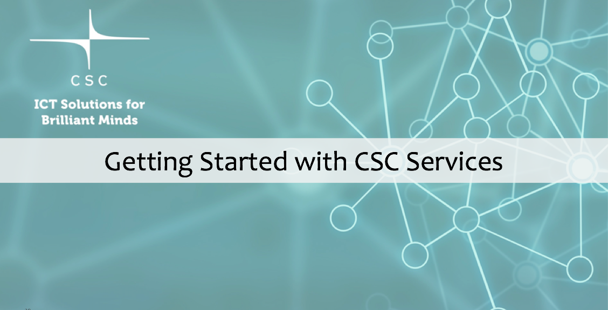{width=90%}

# Getting Access to CSC Services

- Need to have a CSC account to access CSC services
- Use CSC customer portal ([MyCSC](https://my.csc.fi/welcome)) to create an account 
     - Requires  Haka or Virtu user ID (= your institutional e-mail ID)
     - Contact our [ServiceDesk](https://docs.csc.fi/support/contact/) if you are not part of Haka/Virtu federation
- Keep your account alive by updating it once a year
- Use your CSC account to manage projects/CSC services/resources  
- Usage of services is tied to CSC Projects (aka, computing projects)
- CSC services are free of charge for academic use

# More About MyCSC Customer Portal

           
 <small> [MyCSC customer portal:](https://my.csc.fi/welcome) A gateway for managing your CSC accounts/projects</small> 

#

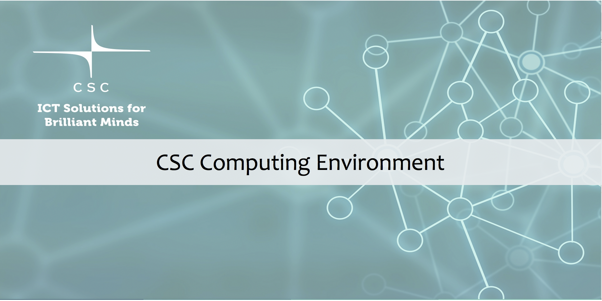{width=90%}

# CSC Supercomputing Environment

- Motivation:
    - Lot of pre-installed applications in CSC environment
    - Need for huge computational resources (Memory, CPUs, GPUs)
    - Limited resources on your local clusters 
    - Parallel and high-throughput computing 
    - Better optimised programmes in CSC environment

- CSC supercomputing options:
    - Puhti – general purpose supercomputer
    - Mahti – massively parallel flagship supercomputer
    - Lumi – one of the EuroHPC pre-exascale supercomputers 

# Which Supercomputer (Puhti vs. Mahti) to Choose From ?

|                             | Puhti  | Mahti    |
| --------------------------- |------- | ----     |
| Number of preinstalled applications   | [123+](https://docs.csc.fi/apps/by_system/#puhti)   | [16+](https://docs.csc.fi/apps/by_system/#mahti)       |
| Cores per node              | 40     | 128       |
| Job size (min-max) cores    | 1-1040 | 128-25600 |
| Memory per node (GiB)       | 192-1536 | 256     |
| GPU cards (NVIDIA)          | 120 x V100 | 96 x A100|
| Fast node local disk (NVMe) | 120   | (24 GPU nodes)  |

In short: Mahti is for much larger parallel jobs, prepare to install and optimize your code.
(Still, a Puhti *node* is > 10x your laptop.)

# Basic Information on Puhti Supercomputer

- Explore pre-installed [bio-software stack](https://docs.csc.fi/apps/)
- Understand your Puhti [workspace directories](https://a3s.fi/CSC_training/03_disk_areas.html#/disk-areas-in-csc-hpc-environment):
     - HOME – most important (small) files, personal access only
     - PROJAPPL – project specific / your installations/ shared binaries
     - SCRATCH – main working area, can be used to share with project members
- Support for module  environment 
     - e.g., `module load gatk/4.2.4.0`
- Submit jobs using [batch queueing system](https://a3s.fi/CSC_training/05_batch_jobs.html#/the-batch-job-system-in-cscs-hpc-environment) 
- Support for [interactive jobs](https://docs.csc.fi/computing/running/interactive-usage/) 
- Support for Singularity [containers and workflows (e.g.,Nextflow)](https://yetulaxman.github.io/containers-workflows/)

# Cloud Computing Use Case

- Motivation:
    - Need for root access
    - Privately deploying tools with web interfaces
    - CSC private cloud (ePouta) for sensitive data
    - Avoid standing in batch queues for the execution of jobs
    - Advanced users – able to manage servers
    - Difficult workflows – can’t run on Puhti

# CSC Cloud Computing Models

- Infrastructure as a Service (IaaS)
     - CSC’s [ePouta](https://research.csc.fi/en/-/epouta)/[cPouta](https://pouta.csc.fi/)
- Platform as a Service (PaaS)
     - [Rahti container cloud](https://docs.csc.fi/cloud/rahti/)
     - [CSC’s Notebooks](https://notebooks.csc.fi/)
- Software as a Service (SaaS)
     - [CSC's Chipster software](https://chipster.rahtiapp.fi/home)

#

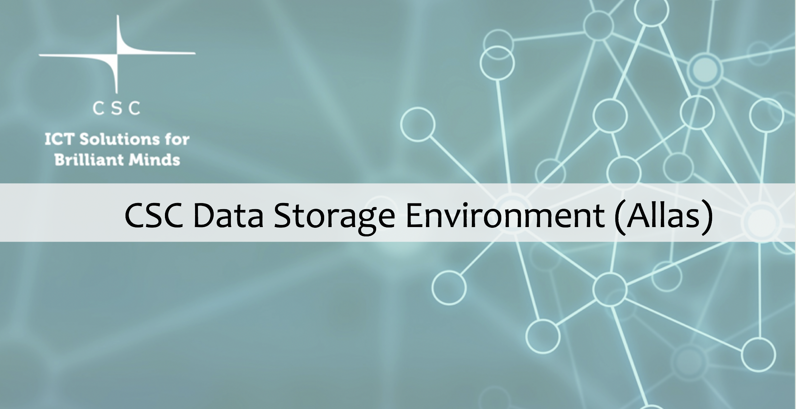{width=90%}

         
# CSC Allas Storage Environment 

- Apply for Allas service in your project and get default quota of 10 TB
- Allas is
    - A storage service for all computing and cloud services
    - A gateway for uploading data from personal laptops or organizational storage systems to CSC environment
    - Meant for data during project lifetime
    - For sharing the data with others at CSC
- Allas is **NOT** a 
   -  File system
   -  Data management environment
   -  Backup service.

# Connecting to Allas
- In Puhti and Mahti, setup connection to Allas with the commands:
   - `module load allas`
   - `allas-conf`
- Allas supports two protocols
   - S3 (used by: s3cmd, rclone, a-tools)
   - Swift (used by: swift, rclone, a-tools, cyberduck)
-  Possible to use GUI clients among the list of [clients for accessing Allas](https://docs.csc.fi/data/Allas/clients/)

#  Allas – a-tools

 - The  a-tools provide easy and safer way to use Allas
 - Developed for CSC environment (Puhti, Mahti) but can be installed in other linux and mac machines too
 - Unlike rclone, a-tools do not overwrite and remove data without asking!
 - Automatic packing and compression
 - Uses default bucket names based on directories of Puhti

# Fairdata.fi Services

- With the Fairdata.fi services you can store, share, describe and publish your research data with easy-to-use web tools.
- IDA – Research data storage service
- ETSIN – Research data finder
- QVAIN – Research dataset metadata tool
- FAIRDATA-PAS –  Digital preservation for research data
- [Fairdata services](https://research.csc.fi/-/fairdata-services) are offered by the Minedu and produced by CSC

# 

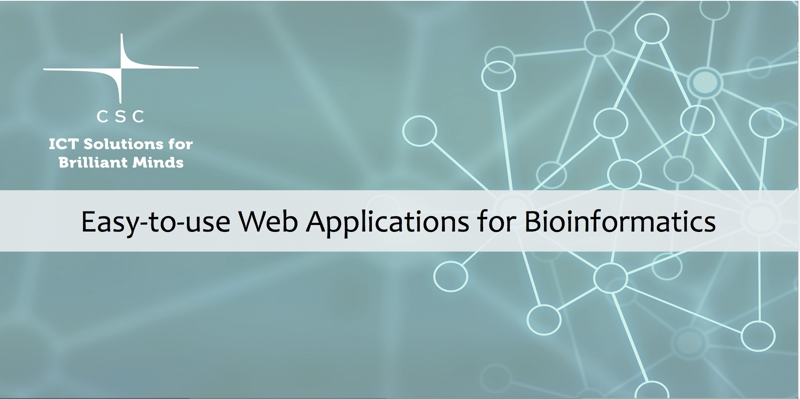{width=90%}

# CSC Notebooks

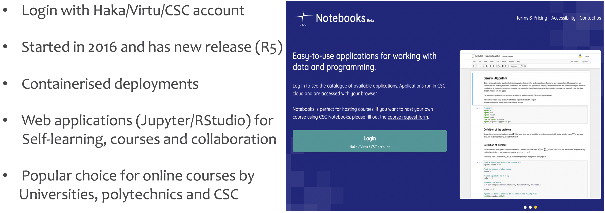
           
 <small> [CSC Notebooks beta:](https://notebooks-beta.rahtiapp.fi/welcome) A gateway for exploring CSC pre-existing notebooks</small> 

# Puhti Web Interface

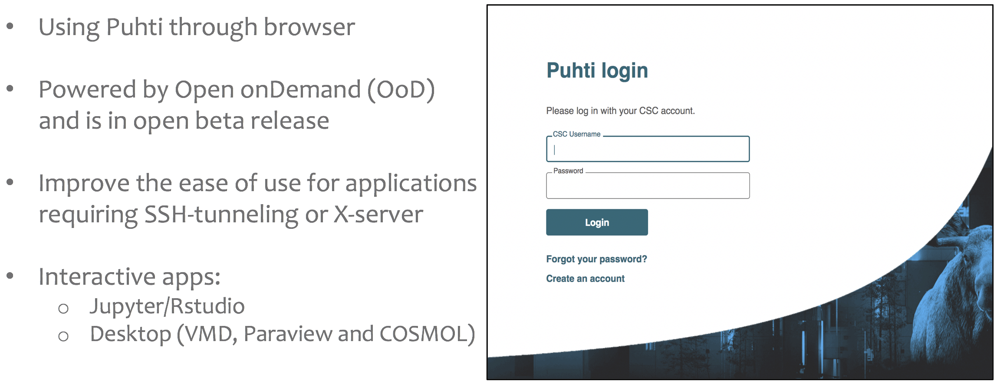
           
 <small> [Puhti web interface](https://www.puhti.csc.fi/public/login.html): Access some of applications on Puhti via browser </small> 

# Chipster – Easy Access to NGS Data Analysis Tools

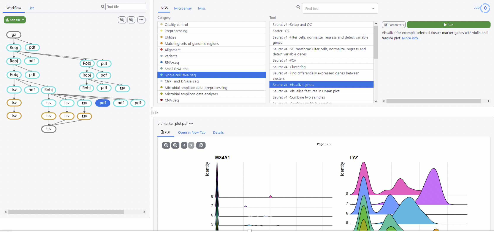{width=90%}

Fig:  A snapshot from single cell RNA-seq analysis in Chipster

</body>
</html>

# Chipster – Efficient And Collaborative Analysis

- About 500 analysis and visualization tools for NGS data
     - Single cell RNA-seq
     - RNA-seq
     - Microbiome analysis
     - ChIP-seq
     - …
- Analyze hundreds of samples with one click
- Analysis metadata is tracked automatically
- Easy to share analysis sessions
- [Visit Chipster home page](https://chipster.csc.fi/)

# Chipster – Visualizations

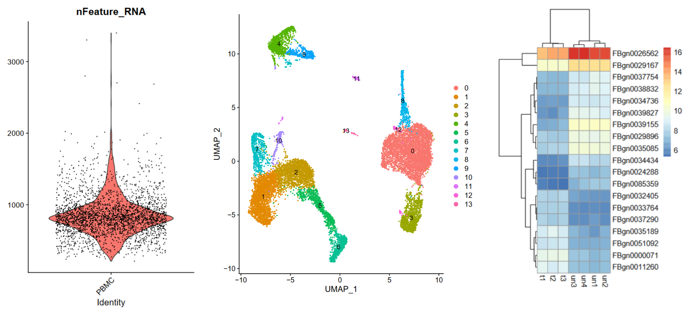{width=90%}

# Chipster – How to Get Started

- Log in with your Haka, Virtu or CSC account
- Check out ready-made example sessions
     - Fully annotated analysis workflows that you can use as a model
     - Training sessions in Chipster, [instructions available](https://chipster.rahtiapp.fi/manual/courses.html) for self-study 
- Watch our YouTube [tutorial videos](https://www.youtube.com/channel/UCnL-Lx5gGlW01OkskZL7JEQ/playlists)
- Any questions, please e-mail chipster@csc.fi

#

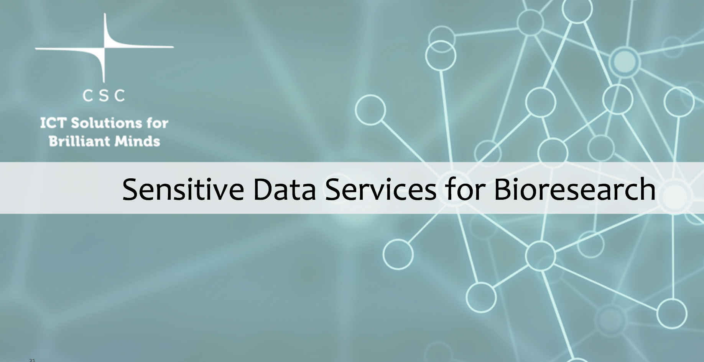{width=90%}

# Sensitive Data Services(SDS) for Bioresearch

- ePouta is a cloud service for processing sensitive data
     - access, use and manage VMs as a self-service model
- [SDS](https://docs.csc.fi/data/sensitive-data/) for Research (Open Beta): Manage, store and share sensitive data at CSC
     - [SD Connect](https://docs.csc.fi/data/sensitive-data/sd_connect/)
     - [SD Desktop](https://docs.csc.fi/data/sensitive-data/sd_desktop/)
- Note: there is no single rule that defines a sufficient security level for a data. It depends on the nature of data, source and owner

# SD Connect and SD Desktop

- SD Connect: Web interface to encrypt and upload data to Allas
     - Properly encrypted sensitive data can be stored at CSC
     - SD Connect does the ecryption with a CSC specific key to be compatible with other CSC SD services
     - SD Connect provides tools for simple data management (upload, download, delete and share)
- SD Desktop: Virtual secure desktop to work with sensitive data
     - Controlled access: only project members can access the desktop
     - Data import only through SD Connect service
     - Isolation from internet
     - No direct data export

# Roadmap for SDS Services in 2022
- First full release of SD Connect and SD Desktop in spring 2022. 
- This release will contain new features like:
     - Controlled data export from SD Desktop (SD Gateway)
     - Multi-factor authentication
     - Possibility to use ELIXIR login
     - Encryption with multiple public keys
     - Security audition to match FinData requrements
- New services for sensitive data:
     - Federated EGA: A data set stored to CSC can be  added to EGA data base
     - SD Submit: Tool to store and describe sensitive datasets at CSC
     - SD Appy: Tools to request and provide a controlled access to a sensitive dataset stored using SD Submit

#

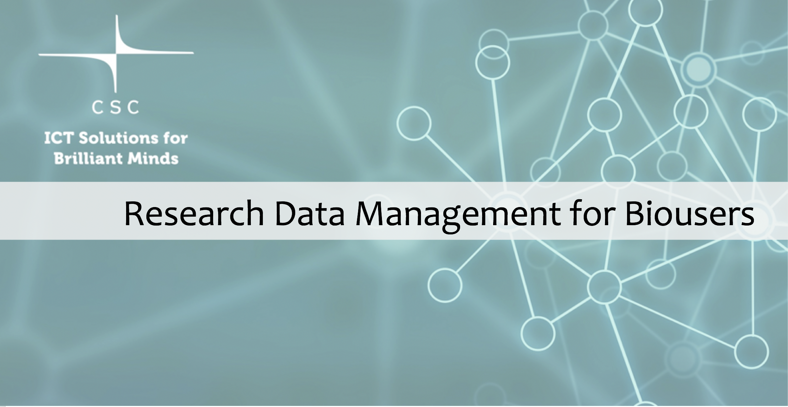{width=90%}

# Research Data Management is The Basis for Successful Research!

- Where to find guidance and help for data management?
     - 
[RDMkit](https://rdmkit.elixir-europe.org/) web page tailor-made for Life Sciences!

     - 
[CSC self-study online RDM course](https://e-learn.csc.fi/course/view.php?id=63) (enroll using Haka)

     - 
[CSC Data Management & Storage web pages](https://research.csc.fi/data-management)

 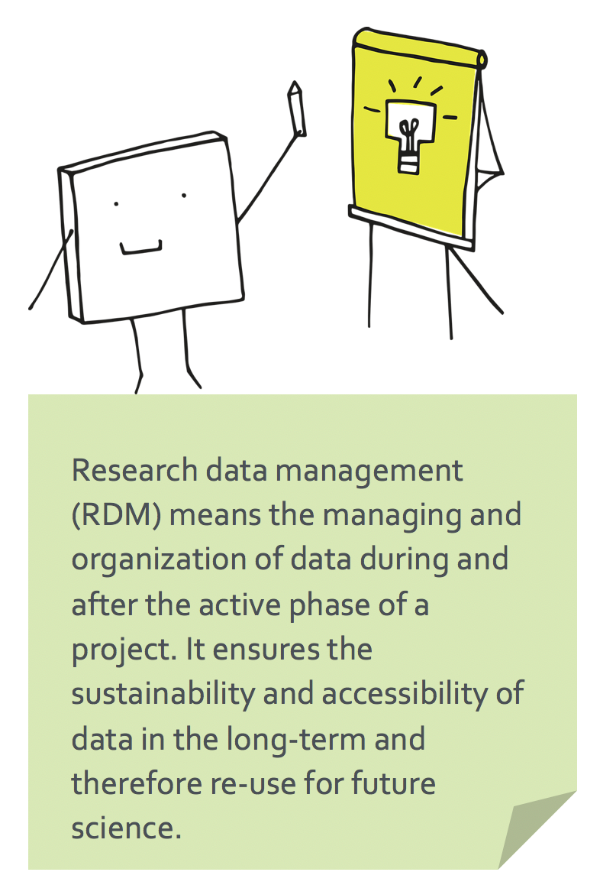{width=55%} 

# The Research Data Management Toolkit for Life Sciences
- [RDMkit](https://rdmkit.elixir-europe.org/) :
     - Online guide containing good data management practices applicable to research projects from the beginning to the end
     - Links to tools, resources and training material given in specific data management context
     - Examples of combination of tools for RDM

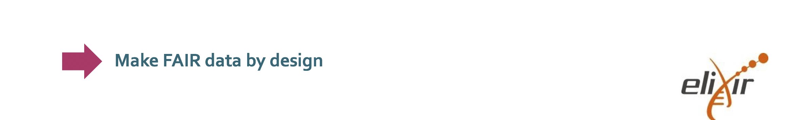

# CSC’s Self-study Research Data Management Course

- [Direct link to the course](https://e-learn.csc.fi/course/view.php?id=63) ([e-learn platform](https://e-learn.csc.fi/))
- The course provides the basics of RDM and focuses on researcher's perspective and aims to introduce the topics, tools and resources available at each phase
- Test your knowledge end of each section answering Quizzes
. 
 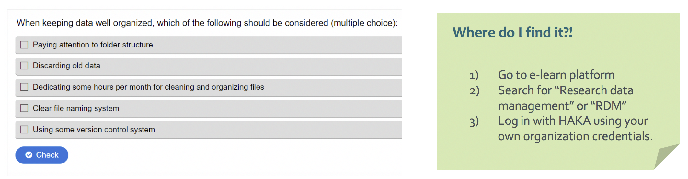

#

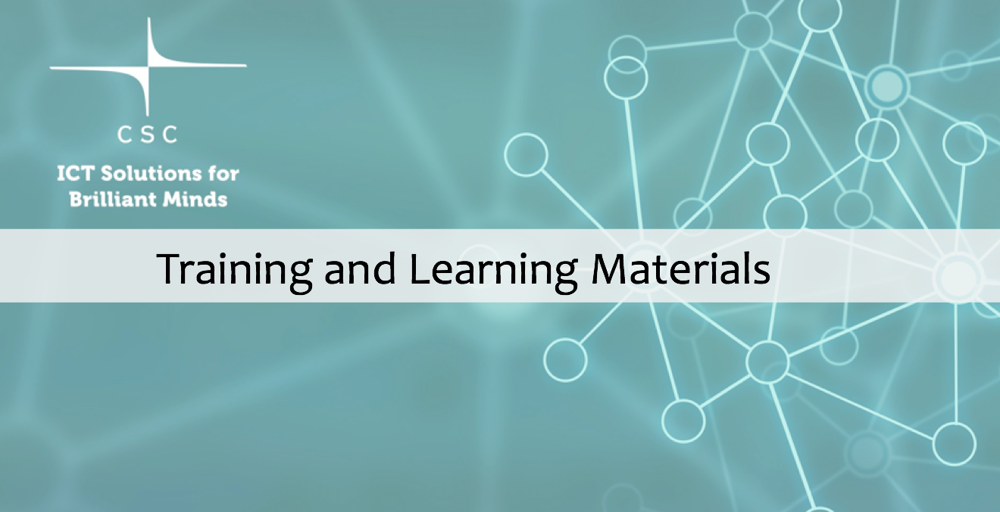{width=90%}

# Training and Learning Materials for Bio-users

- [CSC training portal](https://www.csc.fi/en/training)
- [CSCs online learning portal eLena](https://e-learn.csc.fi/)
- [Course & eLearning materials, tutorials and webinar recordings for bioscientists](https://research.csc.fi/bioscience-learning-materials)
- Chipster: [Youtube channel](https://www.youtube.com/channel/UCnL-Lx5gGlW01OkskZL7JEQ/playlists) & [course material packages](https://chipster.rahtiapp.fi/manual/courses.html)
- [Research Data Management online self-study course](https://e-learn.csc.fi/enrol/index.php?id=63) 
- Next course on [Using CSC HPC Environment Efficiently](https://csc-training.github.io/csc-env-eff/)
- Next BioMonth in March-April

# Take-home Message

- Manage your CSC services  via our CSC customer portal at [MyCSC](https://my.csc.fi/welcome) 
- Make use of tailored resources for [bio-research](https://research.csc.fi/biosciences)  
- Resources are free for open science research (academic use)
- Participate in CSC trainings, read materials and watch webinars in YouTube
- Take advantage of [CSC docs pages](https://docs.csc.fi)
- Join our [e-mail list](https://postit.csc.fi/sympa/subscribe/bioclients) to get our bioinfo newsletter
- Contact our [helpdesk](https://docs.csc.fi/support/contact/) for support and guidance
